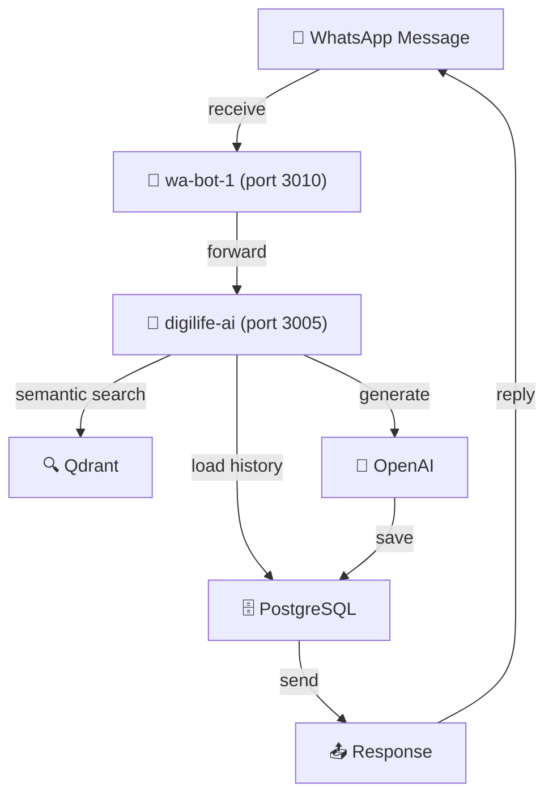

# 🤖 WA Bot Services

WhatsApp Chatbot AI yang menjawab pertanyaan tentang subscription products.

---

## 📋 Overview

**What it does:**
- Receives WhatsApp messages from customers
- Uses AI (GPT-4o-mini) to understand intent
- Looks up pricing & customer data from database
- Generates contextual responses
- Tracks conversation history
- Sends automated reminders

**Services Running:**
```
wa-bot-1 (port 3010)
    ↓
digilife-ai (port 3005) ← Main AI Engine
    ├→ PostgreSQL (conversation history)
    ├→ Qdrant (vector search)
    └→ OpenAI (GPT-4o-mini)

reminder-service (port 3015)
    └→ Scheduled reminders (H-7, H-5, H-1)
```

---

## 🎯 Features

### Core Features
✅ **Message Receiving** - Baileys WhatsApp socket  
✅ **Intent Detection** - Identify what customer wants  
✅ **Pricing Lookup** - Fast database queries  
✅ **AI Responses** - Context-aware via GPT-4o-mini  
✅ **Conversation History** - Persistent in PostgreSQL  
✅ **Reminder System** - Automated H-7, H-5, H-1 reminders  
✅ **Customer Validation** - Check if customer exists  

### NEW Features (PostgreSQL)
✅ **Unlimited History** - No longer limited to 10 messages  
✅ **Reminder Context** - Know when customer responds to reminder  
✅ **Fast Performance** - 10x faster than Google Sheets  
✅ **Metadata Tracking** - Intent, product, context tags  

---

## 🚀 Getting Started

### Check Status
```bash
ssh root@145.79.10.104
pm2 list
pm2 logs wa-bot-1 --lines 20
pm2 logs digilife --lines 20
```

### Test Message
Send WhatsApp message to bot number (check IMPORTANT-NOTES.md for number)

### Check Logs
```bash
pm2 logs digilife
# Should see:
# 📩 Incoming message from Haryadi
# 💬 Conversation history: X messages
# 🎯 Intent detected
# ✅ Response sent
```

---

## 📂 Source Files

| File | Purpose | Location |
|------|---------|----------|
| `bot-1-server.js` | WhatsApp socket (Baileys) | `/Ai Agent/` |
| `digilife-service.js` | AI Engine (old Google Sheets) | `/Ai Agent/` |
| `digilife-service-pg.js` | AI Engine (new PostgreSQL) 🆕 | `/Ai Agent/` |
| `reminder-service.js` | Reminder scheduler | `/Ai Agent/` |
| `server.js` | Actual running service | `/root/Baileys/bot-1/` |

---

## 🔄 How It Works



---

## 📊 Recent Updates (Feb 24, 2026)

### 1. Nginx Port Fix ✅
- Fixed port routing: 3001 → 3005
- Eliminated redundant port listening
- Both local and VPS synchronized

### 2. PostgreSQL Integration ✅
- Created `conversations` table (unlimited history)
- Created `conversation_metadata` table (reminder context)
- Replaced NodeCache with persistent DB storage
- 10x performance improvement (10-50ms vs 2-3s)

### 3. Service Standardization ✅
- `wa-bot-1` - Socket receiver
- `digilife-ai` - Main AI engine
- `reminder-service` - Scheduler
- Structure ready for `wa-bot-2`, `wa-bot-3`, etc.

---

## 📖 Read Next

- [Architecture Details](./ARCHITECTURE.md) - Deep dive into how it works
- [VPS Deployment](./VPS_DEPLOYMENT.md) - How to deploy & maintain
- [PostgreSQL Integration](./POSTGRESQL_INTEGRATION.md) - Database upgrade details
- [Troubleshooting](./TROUBLESHOOTING.md) - Common issues & fixes

---

**Created:** 2026-02-24  
**Status:** ✅ Production ready, 🔄 PostgreSQL deployment pending
