# 🤖 WA Bot Services

WhatsApp Chatbot AI yang menjawab pertanyaan tentang subscription products.

---

## 📋 Overview

**What it does:**
- Receives WhatsApp messages from customers
- Uses AI (GPT-4o-mini) to understand intent
- Looks up pricing & customer data from database
- Generates contextual responses
- Tracks conversation history
- Sends automated reminders

**Services Running (VPS: 145.79.10.104):**
```
fonnte-bot  (PM2 id 26, port 3010)  /root/digilife-bot/
    ↓  Fonnte webhook gateway
digilife    (PM2 id 19, port 3005)  /root/Digilife/
    ├→ PostgreSQL (pricing, customer, groups, conversation)
    ├→ Qdrant (vector search)
    └→ OpenAI (GPT-4o-mini)

reminder    (PM2 id 20, port 3015)  /root/Digilife/
    └→ Scheduled reminders (H-5, H-1)
```

---

## 🎯 Features

### Core Features
✅ **Message Receiving** - Fonnte API gateway (paid plan, no watermark)  
✅ **Intent Detection** - Identify what customer wants  
✅ **Pricing Lookup** - PostgreSQL `pricing` table (45 items)  
✅ **AI Responses** - Context-aware via GPT-4o-mini  
✅ **Conversation History** - Persistent in PostgreSQL `conversations` table  
✅ **Reminder System** - Automated H-5, H-1 reminders; skip FREE status  
✅ **Customer Validation** - Lookup by WA number from `customer_subscriptions`  
✅ **Greeting by Name** - `ka *Nama*` greeting from DB lookup  
✅ **Unlimited History** - No message limit  
✅ **Fast Performance** - 10x faster vs Google Sheets  

---

## 🚀 Getting Started

### Check Status
```bash
ssh root@145.79.10.104
pm2 list
pm2 logs digilife --lines 20
pm2 logs reminder --lines 20
```

### Expected Startup Logs
```
✅ PostgreSQL connected (history + customer lookup)
✅ Loaded 45 pricing items from PostgreSQL
✅ Loaded 531 customer records from PostgreSQL
✅ Data pre-loaded successfully
```

### Deploy Update
```powershell
# From local (PowerShell)
git push; ssh root@145.79.10.104 "cd /root/Digilife && git pull && pm2 restart digilife reminder"
```

---

## 📂 Source Files

| File | Purpose | Local Path | VPS Path |
|------|---------|------------|----------|
| `fonnte-bot.js` | Fonnte webhook gateway | `/Ai Agent/` | `/root/digilife-bot/` |
| `digilife-service.js` | Main AI Engine (PostgreSQL) | `/Ai Agent/` | `/root/Digilife/` |
| `reminder-service.js` | Reminder scheduler | `/Ai Agent/` | `/root/Digilife/` |

**Git Repository:** `markplus-apps/digilife-bot` (branch: `main`)  
**Local → VPS sync:** `git push` → `ssh git pull`  
> ⚠️ `fonnte-bot.js` tidak termasuk dalam git workflow, deploy manual via `scp` jika ada perubahan.

---

## 🔄 How It Works

```mermaid
graph TD
    WA["📱 WhatsApp Message"]
    FONNTE["🤖 fonnte-bot (port 3010)"]
    DIG["🧠 digilife (port 3005)"]
    DB["🗄️ PostgreSQL"]
    QDA["🔍 Qdrant"]
    GPT["🤖 OpenAI GPT-4o-mini"]
    RESP["📤 Response via Fonnte API"]
    
    WA -->|Fonnte webhook POST /webhook| FONNTE
    FONNTE -->|forward POST /inbound| DIG
    DIG -->|load history + customer| DB
    DIG -->|semantic search| QDA
    DIG -->|generate response| GPT
    DIG -->|save conversation| DB
    DIG -->|POST /send-message| FONNTE
    FONNTE -->|Fonnte API| RESP
    RESP -->|reply| WA
```



---

## 📊 Changelog

### Feb 25, 2026 - Full PostgreSQL Migration ✅
- Migrasi semua data dari Google Sheets → PostgreSQL
- `digilife-service.js`: pricing, customer, groups, conversations semua dari DB
- `reminder-service.js`: flat query ke `customer_subscriptions`, skip FREE status
- Fix column names: `wa_pelanggan`, `end_membership`, `status_payment`, `subscription`
- Greeting `ka *Nama*` via DB lookup
- Git workflow: `git push` → `ssh git pull` → `pm2 restart`
- Fonnte upgraded ke paid plan (watermark removed)

### Feb 24, 2026 - Architecture Overhaul ✅
- Migrasi dari Baileys WhatsApp socket → Fonnte API gateway
- PostgreSQL persistent conversation history
- 10x performance improvement

---

## 📖 Read Next

- [Architecture Details](./ARCHITECTURE.md) - Deep dive into how it works
- [Deployment Guide](./DEPLOYMENT.md) - How to deploy, maintain & troubleshoot
- [PostgreSQL Guide](./POSTGRESQL.md) - Database schema & query reference

---

**Last Updated:** 2026-02-25  
**Status:** ✅ Production ready — 100% PostgreSQL, Fonnte gateway active
